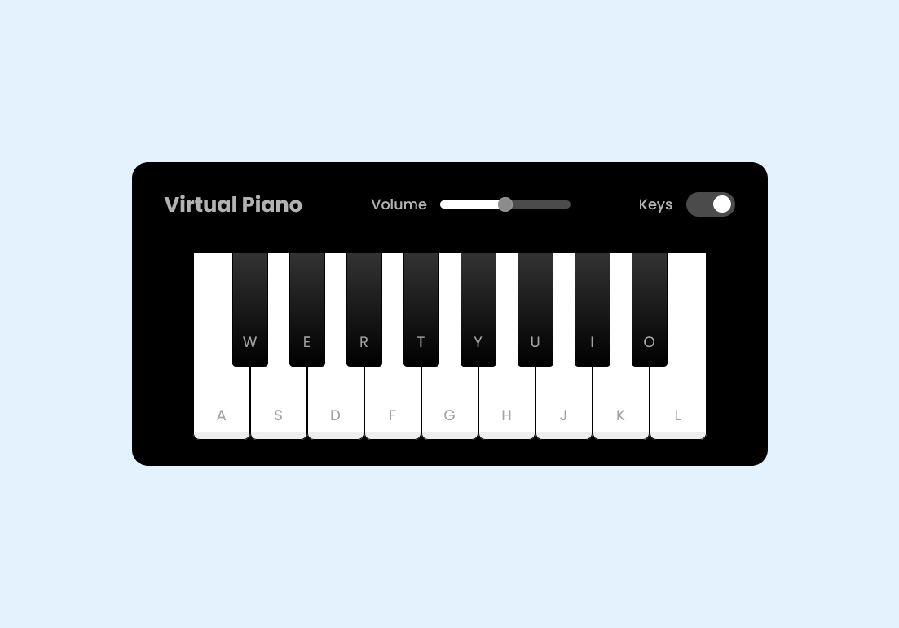

# Piano Simulator

Projeto de simulador de piano proposto em bootcamp da DIO e desenvolvido com HTML, CSS e JavaScript. Os sons podem ser tocados clicando nas teclas ou utilizando as letras indicadas do teclado.

